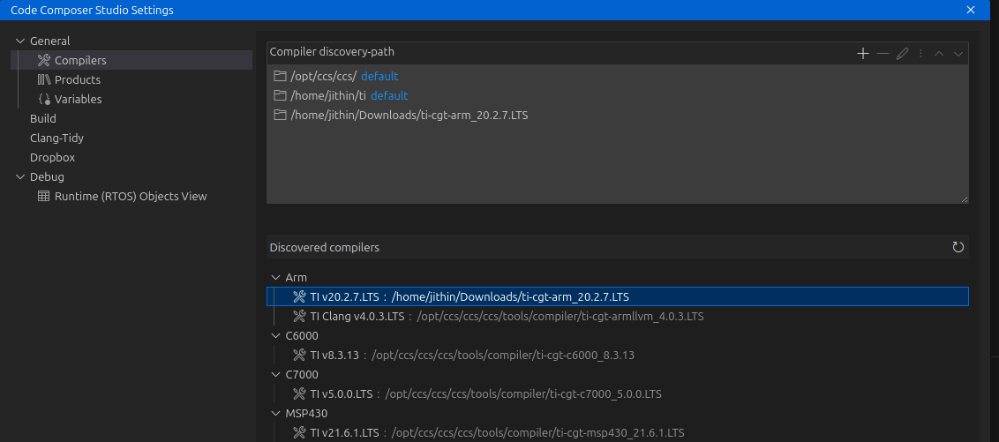
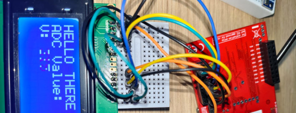
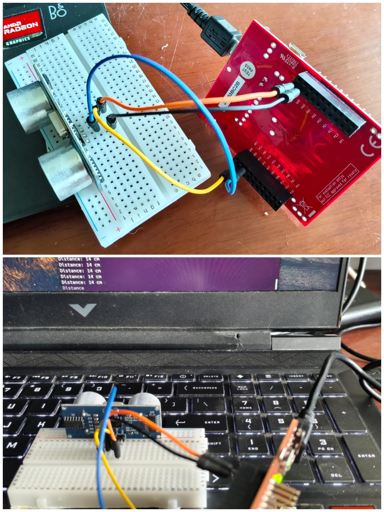
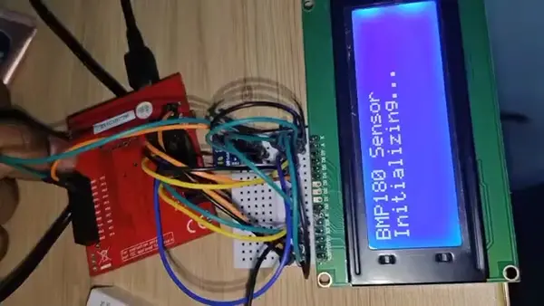
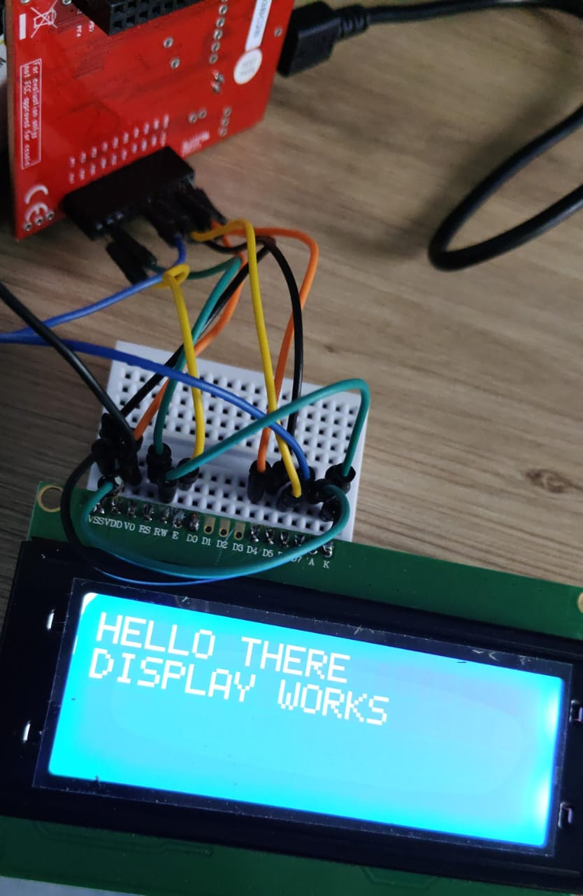

# TI Examples for TIVA ek-tm4c123gxl


/******************************************************************************
 * Author   : Jithin B.P.
 * Affiliation: CSpark Research
 * Email    : jithinuser@gmail.com
 *
 * License  : MIT License
 *
 * Permission is hereby granted, free of charge, to any person obtaining a copy
 * of this software and associated documentation files (the "Software"), to deal
 * in the Software without restriction, including without limitation the rights
 * to use, copy, modify, merge, publish, distribute, sublicense, and/or sell
 * copies of the Software, and to permit persons to whom the Software is
 * furnished to do so, subject to the following conditions:
 *
 * The above copyright notice and this permission notice shall be included in all
 * copies or substantial portions of the Software.
 *
 * THE SOFTWARE IS PROVIDED "AS IS", WITHOUT WARRANTY OF ANY KIND, EXPRESS OR
 * IMPLIED, INCLUDING BUT NOT LIMITED TO THE WARRANTIES OF MERCHANTABILITY,
 * FITNESS FOR A PARTICULAR PURPOSE AND NONINFRINGEMENT. IN NO EVENT SHALL THE
 * AUTHORS OR COPYRIGHT HOLDERS BE LIABLE FOR ANY CLAIM, DAMAGES OR OTHER
 * LIABILITY, WHETHER IN AN ACTION OF CONTRACT, TORT OR OTHERWISE, ARISING FROM,
 * OUT OF OR IN CONNECTION WITH THE SOFTWARE OR THE USE OR OTHER DEALINGS IN THE
 * SOFTWARE.
 *
 * Created  : 2025
 ******************************************************************************/

## Toolchain installation


Examples have issues with CLANG. get ARM-CGT compiler

### Windows
Download [new compiler](https://www.ti.com/tool/ARM-CGT#downloads)

### Ubuntu: (Download from same link above)

```
cd Downloads
chmod +x ./ti_cgt_tms470_20.2.7.LTS_linux-x64_installer.bin
./ti_cgt_tms470_20.2.7.LTS_linux-x64_installer.bin
```

[Discover](https://software-dl.ti.com/ccs/esd/documents/ccs_compiler-installation-selection.html#compiler-discovery) it in File->Preferences-> Code Composer Studio settings -> Compilers -> Discovered Compilers



Pick a simple example, check if it compiles (Ctrl-B) , and duplicate the folder marked `Debug` in the file explorer on the left. If it does not, ensure all libraries are linked. This folder is meant to exist inside the ti-launchpad examples downloaded earlier. Check the screenshot below and modify your project properties accordingly. To open this, right click on the example folder marked `debug`, and select `properties`


## Local debugger (Avoiding cloud)

```bash
user:/opt/ccs/ccs/ccs/ccs_base/common/uscif/xds110$ sudo ./xdsdfu -e

USB Device Firmware Upgrade Utility
Copyright (c) 2008-2019 Texas Instruments Incorporated.  All rights reserved.

Scanning USB buses for supported XDS110 devices...


<<<< Device 0 >>>>

VID: 0x1cbe    PID: 0x00fd
Device Name:   In-Circuit Debug Interface
Manufacturer:  Texas Instruments
Serial Num:    0E23BC2B
Mode:          Runtime
Configuration: Unknown

Found 1 device.
```


## Examples

### adc_simple.c

### char16display_analog_in.c



### sr04.c



### char16display_bmp180.c



### char16display.c

V0 - Contrast pin. 1.84 Volts. Use a potentiometer to set.




## The CMD file


1. What the .cmd file does

A .cmd file in CCS is a linker command file, which tells the TI ARM linker (armcl) how to map sections of your code and data to memory:

    Where the interrupt vector table goes (.intvecs → usually FLASH start).

    Where the .text (code), .data (initialized RAM data), .bss (zeroed RAM data), .stack, and other sections go.

    Defines heap/stack sizes, memory origin addresses, and load/run locations (e.g., .TI.ramfunc).

Without it:

    The linker doesn’t know where to put code and data in the microcontroller memory.

    Your program may not run, or vectors may be in the wrong place, causing crashes.

So it is essential for the final build.
2. Can you rename it?

Yes, you can rename a .cmd file, but with conditions:

    You must tell CCS or the build system the new name:

        In CCS:

            Right-click the project → Properties → Build → ARM Linker → File Search Path → Command File

            Set the new .cmd filename.

        Or in a Makefile: replace the old .cmd reference with the new one.

    Make sure the file still contains correct memory sections for your MCU.

    The .cmd file extension must remain .cmd; just the name can change.

Renaming won’t break the linker as long as CCS knows the new file name.
✅ Summary

    The .cmd file is critical for correct memory layout and linking.

    You can rename it, but update the CCS project settings to point to the new name.

    If you don’t use a .cmd file, you’d have to supply all memory layout information directly in the project settings, which is usually less convenient.

######################


