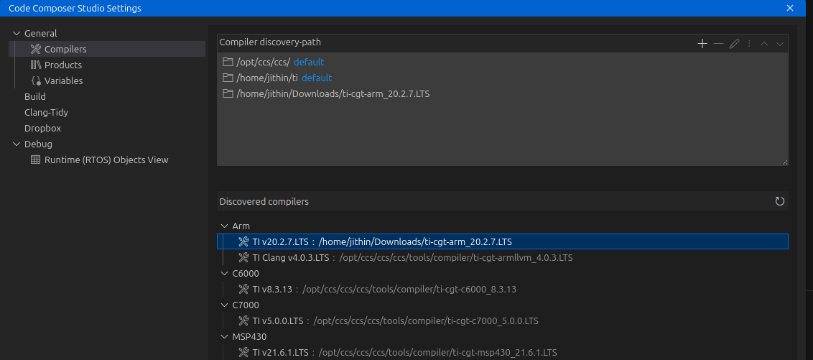
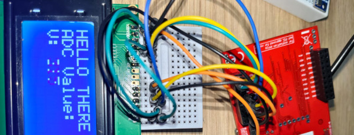
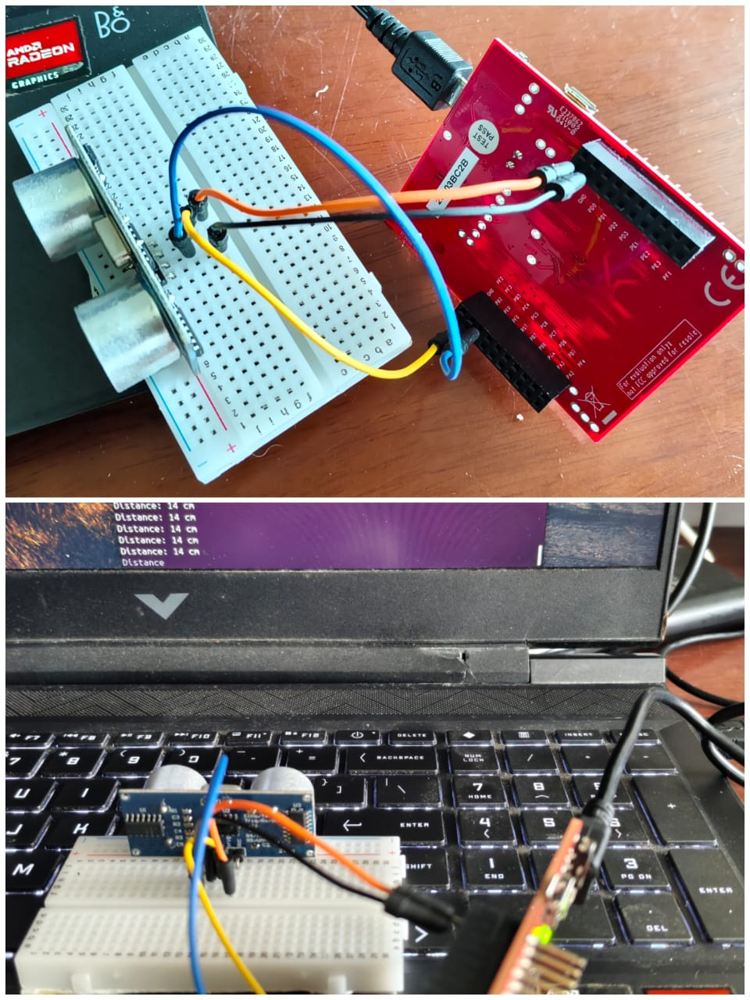
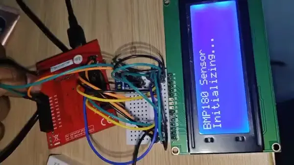
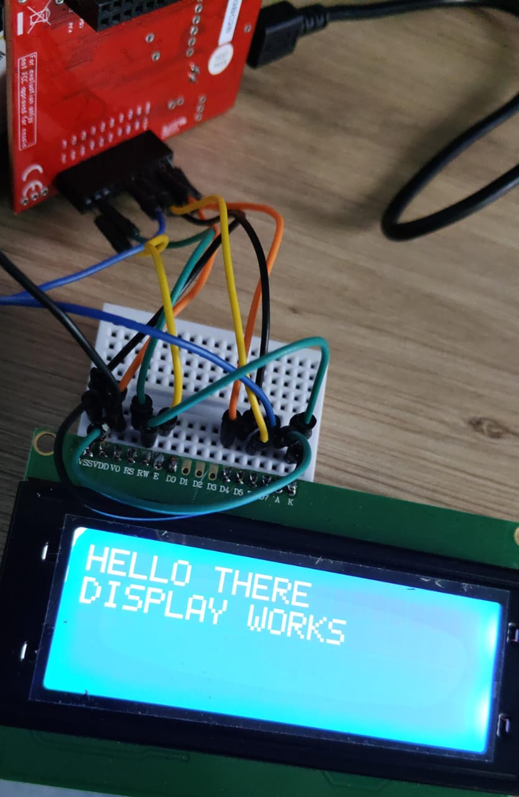

# Welcome to TI TM4C123GXL Examples Workspace!


## Components

+ EK-TM4C123GXL ARM® Cortex®-M4F Based MCU TM4C123G LaunchPad™ Evaluation Kit
+ [37 in 1 Sensor Box](sensors37.html)

<details markdown> <summary>Show all</summary>

+ HC-SR04-Ultrasonic Range Finder
+ Soil Moisture Sensor Module
+ LDR Sensor Module
+ Reed Switch Sensor Module
+ Touch Sensor Module
+ 20 x 4 LCD Display  Module
+ OLED Display Module
+ 3V 2000RPM High Speed DC Toy Motor
+ 28BYJ-48 5V DC Stepper Motor
+ Tilt Sensor Module
+ L293D 4 Channel DC Motor Driver
+ ULN2003 Stepper Motor Driver Module
+ 4X3 Keypad Module
+ Soldering Kit
+ 50 MHz Dual Channel  Digital Storage Oscilloscope (Make : Keysight, Model No. EDUX1052   )
+ 5mm Round Diffused Leds
+ 9V Small Piezo Buzzer
+ 10K ohm Variable Resistor Cermet Preset - 2 pieces pack
+ Resistor Box (150 Resistors and 30 Values)
+ Jumper Wire Set - M2M, M2F, F2F 
+ 170 Points Mini Breadboard
+ GL12 840 Points Solderless Breadboard
+ Alligator clips with Chords

</details>


## Code composer studio

[Download and install instructions](https://software-dl.ti.com/ccs/esd/documents/users_guide/ccs_installation.html#installation-process){:.target="_blank"}


## Toolchain installation

there are known compatibility issues with some older TivaWare examples and the newer TI Arm Clang (tiarmclang) compiler, which is based on LLVM/Clang.
The solution is to switch to the Texas Instruments Arm Code Generation Tools (ARM-CGT), which is the alternative, proprietary TI compiler (sometimes referred to as the TI Arm compiler), or use the newer TI Arm Clang version and follow migration guidelines.

### On MS Windows : Download [new compiler](https://www.ti.com/tool/ARM-CGT#downloads)

### On Ubuntu: (Download from [same link as windows](https://www.ti.com/tool/ARM-CGT#downloads))

Install the compiler

```
cd Downloads
chmod +x ./ti_cgt_tms470_20.2.7.LTS_linux-x64_installer.bin
./ti_cgt_tms470_20.2.7.LTS_linux-x64_installer.bin
```

[Discover](https://software-dl.ti.com/ccs/esd/documents/ccs_compiler-installation-selection.html#compiler-discovery) it in File->Preferences-> Code Composer Studio settings -> Compilers -> Discovered Compilers



Pick a simple example, check if it compiles (Ctrl-B) , and duplicate the folder marked `Debug` in the file explorer on the left. If it does not, ensure all libraries are linked. This folder is meant to exist inside the ti-launchpad examples downloaded earlier. Check the screenshot below and modify your project properties accordingly. To open this, right click on the example folder marked `debug`, and select `properties`


### Local debugger (Avoiding cloud)

<details markdown><summary>details</summary>

```bash
user:/opt/ccs/ccs/ccs/ccs_base/common/uscif/xds110$ sudo ./xdsdfu -e

USB Device Firmware Upgrade Utility
Copyright (c) 2008-2019 Texas Instruments Incorporated.  All rights reserved.

Scanning USB buses for supported XDS110 devices...


<<<< Device 0 >>>>

VID: 0x1cbe    PID: 0x00fd
Device Name:   In-Circuit Debug Interface
Manufacturer:  Texas Instruments
Serial Num:    0E23BC2B
Mode:          Runtime
Configuration: Unknown

Found 1 device.
```

</details>

## Install TIVAWARE : [TivaWare_C_Series-2.2.0.295](https://dr-download.ti.com/secure/software-development/software-development-kit-sdk/MD-oCcDwnGrsI/2.2.0.295/SW-TM4C-2.2.0.295.exe)

EK-TM4C123GXL Kit Software. requires TI Login.

[insrtructions at IISC](https://labs.dese.iisc.ac.in/embeddedlab/tivaware/)

<details markdown><summary>Tools included in the TivaWare for C Series suite</summary>

The TivaWare for C Series suite contains and integrates all user-required source-code functions and object libraries, which include:

+ Peripheral Driver Library (DriverLib)
+ Graphic Library
+ USB Library
+ Sensor Hub Library

+ Open Source RTOS
+ Open Source Stacks
+ Utilities
+ Boot Loader and In-System Programming Support
+ Example Codes
+ Third-Party Examples

</details>

## New Examples in this repo

### adc_simple.c

### char16display_analog_in.c



### sr04.c



### char16display_bmp180.c



### char16display.c

V0 - Contrast pin. 1.84 Volts. Use a potentiometer to set.




## The CMD file

[what is the CMD file](cmd_file)


######################


---
Developed by Jithin B.P @CSpark Research
